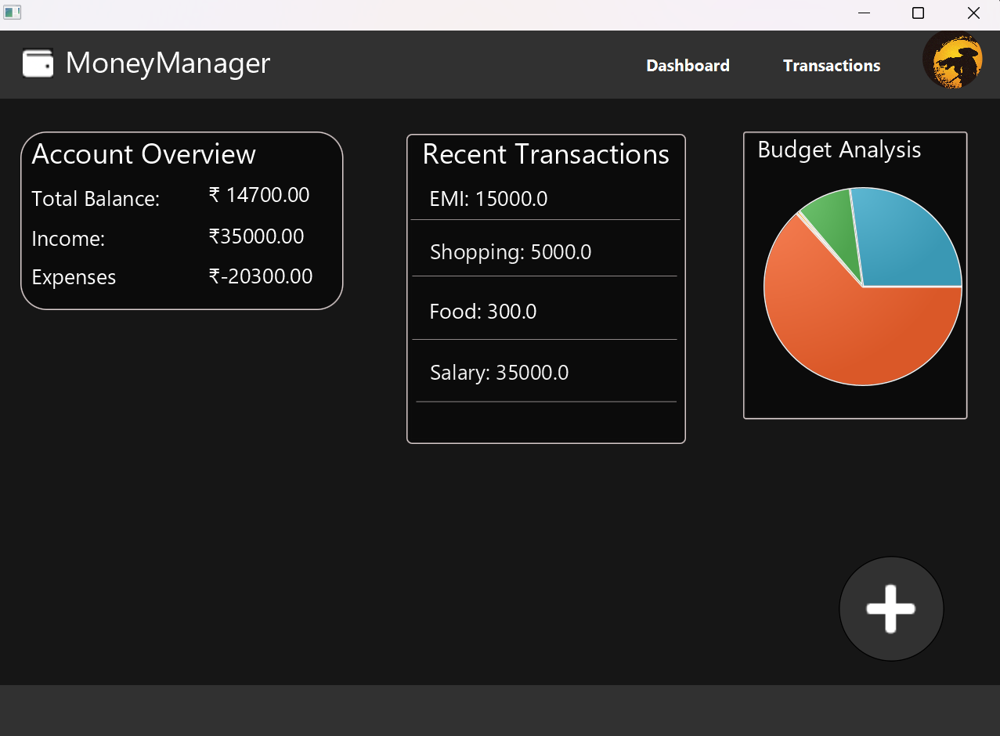
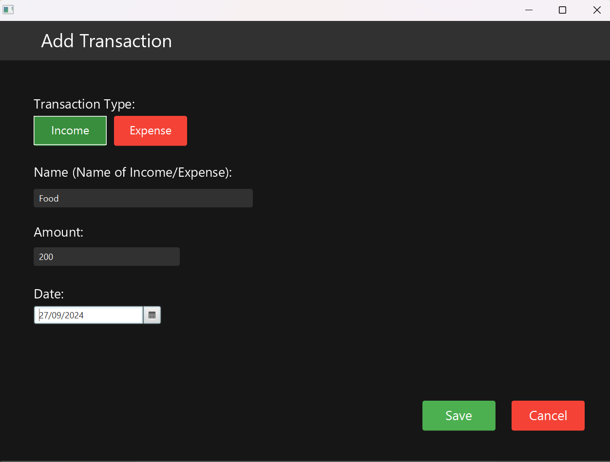
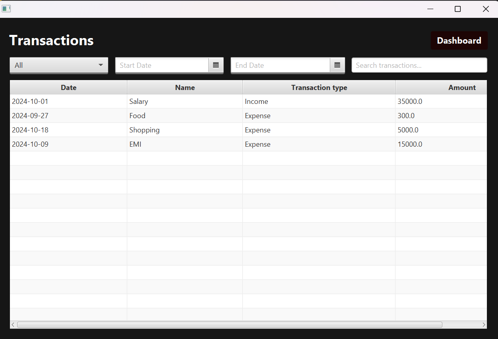

# FX MONEY MANAGEMENT Application (Minor Project)

Designed a desktop application using **JavaFX**, **Maven**, and **SQLite** to help users monitor their budgets and track financial transactions.

## Features
- Track income and expenses
- Set and manage monthly budgets

## Technologies Used
- JavaFX for the UI
- Maven for project management
- SQLite for the database

## Screenshots
<!-- Replace these with actual image URLs -->







## How to Run

1. **Clone the repository** and run the following commands:
   ```bash
   git clone https://github.com/gold-roger33/FXMONEY_MANAGEMENT.git
   
   cd FXMONEY_MANAGEMENT
  
   mvn clean install
  
   mvn javafx:run

